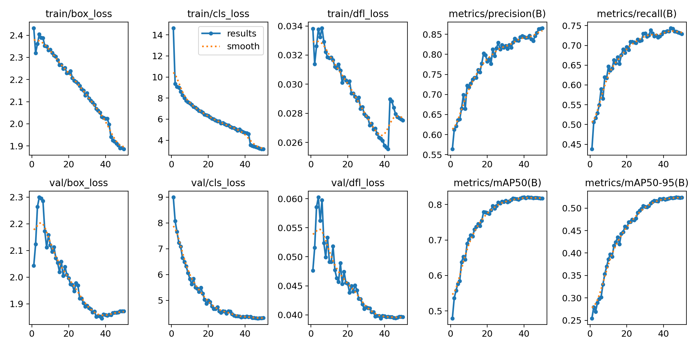

# Forest fire and smoke detection on Raspberry Pi 4

This project deploys the trained Ultralytics YOLO26 small object detector on a Raspberry Pi 4 Model B. The Streamlit interface accepts an image, runs inference on the Pi's CPU, creates a PDF report, and can copy the report to a workstation over SSH/SCP.

The model detects two classes: **Fire** (class ID `0`) and **Smoke** (class ID `1`). The supplied checkpoint was trained in a GPU notebook; deployment on the Raspberry Pi is CPU-only. No NVIDIA GPU, CUDA, cuDNN, `timm`, or `segmentation-models-pytorch` is required. Ultralytics' Raspberry Pi guide describes installing its package on Pi and supports CPU inference: [Ultralytics Raspberry Pi guide](https://docs.ultralytics.com/guides/raspberry-pi).

## What is in this project

| File | Purpose |
| --- | --- |
| `streamlit_app.py` | Web UI for uploading an image, running CPU inference, viewing detections, and creating/downloading/sending a PDF. |
| `pdf_report.py` | Builds a PDF with the annotated image, model name, inference time, and each detection's class, confidence, and bounding box. |
| `benchmark.py` | Measures repeated end-to-end model inference latency and samples the Pi's CPU temperature. |
| `requirements.txt` | Python dependencies for the application. |
| `final_outputs/detect/train/weights/best.pt` | Best trained checkpoint currently included in this workspace. Copy it to `models/best.pt` on the Pi. |
| `final_outputs/detect/train/weights/last.pt` | Checkpoint saved at the end of training (epoch 50). |
| `final_outputs/detect/train/results.csv` | Per-epoch training losses and validation metrics used for the summary below. |
| `final_outputs/detect/train/results.png` | Ultralytics summary plot of training losses and validation metrics. |

## Model training summary

The run configuration in `final_outputs/detect/train/args.yaml` records a **50 epoch** YOLO26s detection run, initialized from pretrained weights. It used 832-pixel training images, batch size 16, SGD, and validation after each epoch. Training was performed with CUDA device `0` in the original notebook. That training hardware is separate from the CPU-only Pi deployment target.

### Training configuration

| Setting | Value |
| --- | --- |
| Task / model | Object detection / YOLO26s (`yolo26s.pt` base) |
| Epochs | 50 configured; all 50 epochs have rows in `results.csv` |
| Input size | 832 × 832 pixels for training/validation |
| Batch size | 16 |
| Optimizer | SGD |
| Initial learning rate (`lr0`) | 0.00425 |
| Final learning-rate factor (`lrf`) | 0.15, cosine schedule enabled |
| Momentum / weight decay | 0.937 / 0.00035 |
| Warm-up | 3 epochs |
| Seed / deterministic | 0 / enabled |
| Pretrained initialization | Enabled |
| AMP during training | Enabled |
| Mosaic / close mosaic | 0.60 / last 8 epochs |
| MixUp / Copy-Paste | 0.08 / 0.12 |
| Geometric augmentation | scale 0.60, translate 0.12, degrees 1.5, shear 0.8, horizontal flip 0.40 |
| HSV augmentation | hue 0.01, saturation 0.38, value 0.30 |
| Dataset config path recorded by run | `/kaggle/working/optimized_fire_dataset/data.yaml` (original notebook environment) |

The notebook creates a merged, optimized two-class dataset and configures `Fire` as class 0 and `Smoke` as class 1. Its optimization cell targets 15,400 total samples. The original dataset files and final dataset manifest are not included here, so the exact split sizes and the realized post-cleaning sample count cannot be confirmed from this project copy.

The final training cell in the notebook also modifies Ultralytics' classification loss and task-aligned label assignment to weight Fire detections, including focal modulation. The checkpoint should therefore be used with compatible Ultralytics code. The training notebook itself is exploratory and modifies the installed Ultralytics package; it is not part of the Pi inference path.

### Recorded validation metrics

Values below are read from the run's `results.csv`. The highest recorded validation mAP@0.5:0.95 occurred at epoch 47. Epoch 50 is the last epoch, so `last.pt` and `best.pt` are not necessarily the same checkpoint.

| Checkpoint point | Epoch | Precision | Recall | mAP@0.5 | mAP@0.5:0.95 | Train box loss | Train class loss | Train DFL loss | Val box loss | Val class loss | Val DFL loss |
| --- | ---: | ---: | ---: | ---: | ---: | ---: | ---: | ---: | ---: | ---: | ---: |
| Best validation mAP@0.5:0.95 row | 47 | 0.85378 | 0.73446 | 0.81934 | 0.52430 | 1.90249 | 3.30633 | 0.02775 | 1.86749 | 4.30560 | 0.03951 |
| Final epoch | 50 | 0.86552 | 0.72917 | 0.81746 | 0.52368 | 1.88561 | 3.16543 | 0.02751 | 1.87220 | 4.32942 | 0.03961 |

Precision, recall, and mAP are reported as fractions (for example, `0.81934` is about 81.9%). mAP@0.5 evaluates detections using an IoU threshold of 0.5. mAP@0.5:0.95 averages across IoU thresholds from 0.5 to 0.95 and is a stricter localization measure. Box, class, and DFL losses are separate training objectives; lower values are generally better, but they are not accuracy percentages.

These are **validation** values from the training run, not an independent test-set result or a guarantee of real-world performance. The notebook contains a later test split evaluation command, but its resulting metrics are not present in the saved artifacts listed here. Validate the model on representative local fire/smoke imagery before relying on it operationally.

### Loss and metric curves

The recorded run includes these Ultralytics plots. Click an image to open its full-size version.



Additional curves and diagnostics:

| Plot | What it shows |
| --- | --- |
| [Precision vs confidence](final_outputs/detect/train/BoxP_curve.png) | Precision as the detection confidence threshold changes. |
| [Recall vs confidence](final_outputs/detect/train/BoxR_curve.png) | Recall as the confidence threshold changes. |
| [F1 vs confidence](final_outputs/detect/train/BoxF1_curve.png) | F1 score as the confidence threshold changes. |
| [Precision-recall curve](final_outputs/detect/train/BoxPR_curve.png) | Precision/recall trade-off across confidence values; its area informs AP. |
| [Confusion matrix](final_outputs/detect/train/confusion_matrix.png) | Validation class confusions, including background false positives/missed objects. |
| [Normalized confusion matrix](final_outputs/detect/train/confusion_matrix_normalized.png) | Confusion matrix normalized for easier comparison across classes. |
| [Training labels overview](final_outputs/detect/train/labels.jpg) | Training-set box/class distribution visualization emitted by Ultralytics. |

The curve files are produced by the saved training run; they are not recomputed by the Pi app. The app's confidence slider controls runtime filtering and does not change the model weights.

## Raspberry Pi setup

Use a 64-bit Raspberry Pi OS installation and connect the Pi and workstation to the network. Clone the published Git remote on the Pi:

```sh
git clone <your-repository-url>
cd <repository-directory>
sudo apt update
sudo apt install -y python3-venv python3-pip openssh-client
python3 -m venv --system-site-packages .venv
source .venv/bin/activate
python -m pip install --upgrade pip
python -m pip install -r requirements.txt
mkdir -p models
```

Transfer the trained checkpoint from the development computer to the Pi. From the computer that has this workspace:

```sh
scp final_outputs/detect/train/weights/best.pt <pi-user>@<pi-ip>:<repository-directory>/models/best.pt
```

Alternatively, copy it to `models/best.pt` by USB. Check that the file exists before starting the app. Model weights are excluded from Git so cloning the source does not automatically transfer the checkpoint. The current `best.pt` in this workspace is about 20.3 MB (19.4 MiB).

Run Streamlit on the Pi:

```sh
source .venv/bin/activate
streamlit run streamlit_app.py --server.address 0.0.0.0
```

From a browser on the same network, open `http://<pi-ip-address>:8501`. The upload and model prediction run on the Pi. The page displays the original image and annotated prediction, the end-to-end inference time, and detection classes/confidences. It writes the report under `reports/` by default and offers a PDF download in the browser.

### Try the built-in demo images

Choose **Try a demo image** in the app to browse the samples stored in `benchmark_images/`. Images are grouped by folder, such as `fire/`, `Smoke/`, and `non fire/`; choose a group and image, then click **Run detection**. Add your own JPG, JPEG, PNG, BMP, or WebP examples under a class-named folder in `benchmark_images/` to extend the gallery. Demo images are only examples for trying the UI; they are not used to train or benchmark the model automatically.

### Configuration options

The defaults are defined by the app. Set these environment variables before launching Streamlit to override them:

| Variable | Default | Purpose |
| --- | --- | --- |
| `MODEL_PATH` | `models/best.pt` | Path to the Ultralytics checkpoint. |
| `REPORT_DIR` | `reports/` | Local directory where generated PDFs are stored. |
| `TORCH_NUM_THREADS` | `4` | CPU threads used by PyTorch inference. |
| `WORKSTATION_SCP_TARGET` | unset | SSH destination in `user@hostname` or `user@IP` form. |
| `WORKSTATION_REPORT_DIR` | `~/forest-fire-reports` | Destination directory on the workstation. |

For example:

```sh
export MODEL_PATH="$PWD/models/best.pt"
export REPORT_DIR="$PWD/reports"
export TORCH_NUM_THREADS=4
export WORKSTATION_SCP_TARGET='alice@192.168.1.20'
export WORKSTATION_REPORT_DIR='~/forest-fire-reports'
streamlit run streamlit_app.py --server.address 0.0.0.0
```

## Image-to-report-to-workstation flow

1. A user selects an image in the Streamlit page opened from the workstation.
2. The browser sends the uploaded image to the Streamlit process running on the Pi.
3. The Pi loads `models/best.pt` and runs YOLO inference with `device="cpu"`.
4. The Pi displays the annotated detections and writes a PDF report locally.
5. The UI provides the report as a browser download. If the SCP option is enabled and configured, the Pi also copies the PDF to the workstation.

### Configure passwordless SCP

SCP is initiated **from the Pi to the workstation**. The workstation must accept SSH connections, and the Pi must authenticate to it without prompting. On the workstation, install/enable an SSH server and ensure the user has permission to write to the chosen report directory. Then, as the same Linux account that runs Streamlit, generate an SSH key on the Pi and install its public key on the workstation using the platform's supported method. Verify from the Pi:

```sh
ssh user@workstation-host
scp sample.pdf user@workstation-host:~/forest-fire-reports/
```

After key-based login works, set `WORKSTATION_SCP_TARGET` and `WORKSTATION_REPORT_DIR` and restart Streamlit. The application creates the destination directory over SSH before copying the PDF. If the destination is not configured, inference and local PDF download still work; the page reports that SCP is not configured. If SCP fails, check workstation firewall/SSH service, key permissions, hostname/IP reachability, and write access.

Treat this as a trusted-network application: Streamlit is bound to all interfaces by the example command, so anyone who can reach the Pi's Streamlit port may be able to submit images. Restrict network access appropriately.

## Benchmarking inference and thermals

Run the benchmark on the Raspberry Pi using the 30 selected demo images in `benchmark_images/` (10 Fire, 10 Smoke, and 10 No fire):

```sh
python benchmark.py
```

The script sorts each class folder by filename and measures the first 10 supported images in each group, so the same 30 files are selected consistently. It performs three unmeasured warm-up inferences on the first image, then one measured inference per selected image. It reports overall and per-group latency summaries, per-image detection counts, and available temperature samples. The JSON report contains the full results; a CSV contains one row per image.

Optional settings:

| Option | Default | Meaning |
| --- | --- | --- |
| `--model` | `models/best.pt` (or the included `final_outputs/.../best.pt` if present) | Checkpoint path. |
| `--images-dir` | `benchmark_images/` | Parent directory containing the three class folders. |
| `--warmup` | `3` | Unmeasured warm-up inferences on the first selected image. |
| `--imgsz` | `640` | Inference image size. |
| `--threads` | `4` | PyTorch CPU thread count. |
| `--output` | `benchmark_results.json` | JSON summary and per-image results destination. |
| `--csv-output` | `benchmark_results.csv` | CSV per-image results destination. |

The console shows latency and temperature for each image. Timing is wall-clock time around `model.predict`, which includes preprocessing, model execution, and detection postprocessing; it is not a pure neural-network kernel timing. Temperature is read from Linux thermal sysfs when available, with `vcgencmd measure_temp` as a fallback. The benchmark is CPU-only and does not require a fan or a particular thermal sensor interface.

For useful comparisons, use the same 30 images, image size, thread count, power supply, cooling arrangement, and room conditions. Let the device cool to a similar starting temperature. A Pi 4 is substantially slower than the GPU used for training; actual speed depends on the checkpoint, input resolution, OS, cooling, and system load.

## Dependency note

The earlier `torch`, `torchvision`, `timm`, and `segmentation-models-pytorch` example does not match this YOLO checkpoint. This app uses Ultralytics, Streamlit, Pillow, and fpdf2. The Raspberry Pi has no NVIDIA CUDA GPU, so inference explicitly selects CPU. Do not install NVIDIA CUDA/cuDNN packages for this Pi deployment. PyTorch is brought in through the Ultralytics dependency chain using a build compatible with the target platform; follow the [Ultralytics Raspberry Pi installation guidance](https://docs.ultralytics.com/guides/raspberry-pi) if pip/platform-specific installation issues arise.

## Publish and clone the source repository

The current project directory must be committed and pushed to a Git hosting remote before the Pi can clone it wirelessly. Model weights are ignored by `.gitignore`, so transfer them separately as shown above.

```sh
git init
git add .
git commit -m "Add Raspberry Pi CPU inference app"
git branch -M main
git remote add origin <your-repository-url>
git push -u origin main
```

On the Pi, use the resulting repository URL with the clone command in the setup section. Keep credentials, `.env` files, benchmark output, generated reports, and large checkpoints out of the source repository.
